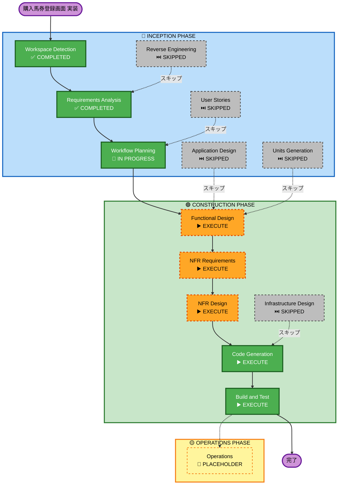

# 実行計画

## 詳細分析サマリー

### 変更スコープ（Brownfield）
- **変更タイプ**: 新機能追加（複数コンポーネント）
- **主な変更**: DB マイグレーション5本、Laravel Controller/Model/FormRequest、React FSD コンポーネント群
- **影響コンポーネント**: backend (source/), frontend (source/resources/js/)

### 変更影響評価
| 領域 | 影響 | 説明 |
|---|---|---|
| ユーザー向け変更 | あり | 購入馬券登録・払い戻し入力の新規画面 |
| 構造的変更 | あり | 新FSDスライス（features/add-ticket 等）追加 |
| データモデル変更 | あり | 5テーブル新規追加（venues, meetings, races, tickets, payouts） |
| API変更 | あり | 新規エンドポイント（POST /tickets 等） |
| NFR影響 | あり | セキュリティ・PBT拡張ルール適用 |

### リスク評価
- **リスクレベル**: Medium
- **ロールバック複雑度**: Moderate（マイグレーション rollback + ルート削除）
- **テスト複雑度**: Moderate（find-or-create ロジック + 連続登録UX）

---

## ワークフロー可視化

---

## 実行フェーズ詳細

### 🔵 INCEPTION PHASE
- [x] Workspace Detection — COMPLETED
- [x] Reverse Engineering — SKIPPED（specs/に詳細ドキュメントあり）
- [x] Requirements Analysis — COMPLETED
- [x] User Stories — SKIPPED（単一ユーザー・シンプルCRUD）
- [x] Workflow Planning — IN PROGRESS（本ドキュメント）
- [ ] **Application Design — EXECUTE**（バックエンドのサービスレイヤー設計が必要。ユーザー判断により追加）
- [ ] Units Generation — SKIPPED（単一フィーチャーユニット、分解不要）

### 🟢 CONSTRUCTION PHASE
- [ ] **Functional Design — EXECUTE**
  - 理由: 新規データモデル設計、find-or-create ロジック定義、PBT-01（プロパティ特定）が必要
- [ ] **NFR Requirements — EXECUTE**
  - 理由: SECURITY拡張（A選択）+ PBT拡張（A選択）が有効。技術スタック決定が必要
- [ ] **NFR Design — EXECUTE**
  - 理由: NFR Requirements が実行されるため、セキュリティパターンを設計に組み込む
- [ ] Infrastructure Design — SKIPPED（インフラ変更なし、Laravelアプリケーション内の変更のみ）
- [ ] **Code Generation — EXECUTE**（常に実行）
- [ ] **Build and Test — EXECUTE**（常に実行）

### 🟡 OPERATIONS PHASE
- [ ] Operations — PLACEHOLDER

---

## 実行ユニット

今回は単一ユニットとして実装する:

**Unit 1: 購入馬券登録画面**
- バックエンド: migrations + models + controller + routes + form requests
- フロントエンド: entities/ticket, entities/venue, entities/race, features/add-ticket, features/record-payout, pages/tickets/create

---

## 成功基準
- **主目標**: 購入馬券を連続入力できる登録フォーム画面の完成
- **主要成果物**:
  - DB マイグレーション（5本）
  - Laravel Controller/Model/FormRequest（5リソース）
  - React FSD コンポーネント群（features + entities + pages）
  - テスト（example-based + PBT）
- **品質ゲート**:
  - SECURITY ルール準拠確認
  - PBT ルール準拠確認
  - バリデーション二重実装（クライアント + サーバー）
  - 認証ミドルウェア適用確認
