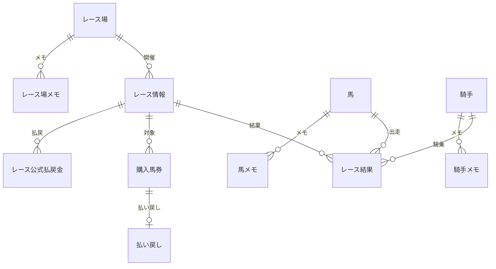

# 概念ER図

エンティティ間の関係を示す。属性の詳細は [entities.yaml](entities.yaml) を参照。

```mermaid
erDiagram
    レース場 ||--o{ レース情報 : "開催"
    レース場 ||--o{ レース場メモ : "メモ"
    レース情報 ||--o{ レース結果 : "結果"
    レース情報 ||--o{ 購入馬券 : "対象"
    レース情報 ||--o{ レース公式払戻金 : "払戻"
    馬 ||--o{ レース結果 : "出走"
    馬 ||--o{ 馬メモ : "メモ"
    騎手 ||--o{ レース結果 : "騎乗"
    騎手 ||--o{ 騎手メモ : "メモ"
    購入馬券 ||--o| 払い戻し : "払い戻し"

```
