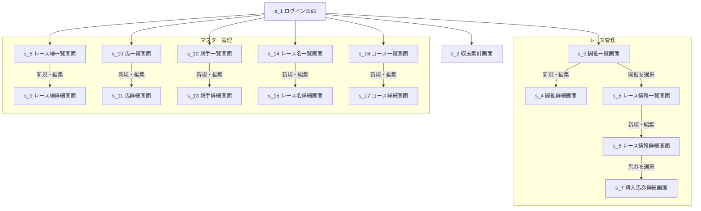

# 画面遷移図

画面間の遷移ルートを示す。画面IDは [screens.yaml](screens.yaml) を参照。

```mermaid
flowchart TD
    s_1[s_1 ログイン画面]

    s_1 --> s_2[s_2 収支集計画面]
    s_1 --> s_3

    subgraph レース管理
        s_3[s_3 開催一覧画面]
        s_3 -->|新規・編集| s_4[s_4 開催詳細画面]
        s_3 -->|開催を選択| s_5[s_5 レース情報一覧画面]
        s_5 -->|新規・編集| s_6[s_6 レース情報詳細画面]
        s_6 -->|馬券を選択| s_7[s_7 購入馬券詳細画面]
    end

    subgraph マスター管理
        s_8[s_8 レース場一覧画面] -->|新規・編集| s_9[s_9 レース場詳細画面]
        s_10[s_10 馬一覧画面]     -->|新規・編集| s_11[s_11 馬詳細画面]
        s_12[s_12 騎手一覧画面]   -->|新規・編集| s_13[s_13 騎手詳細画面]
        s_14[s_14 レース名一覧画面] -->|新規・編集| s_15[s_15 レース名詳細画面]
        s_16[s_16 コース一覧画面]  -->|新規・編集| s_17[s_17 コース詳細画面]
    end

    s_1 --> s_8
    s_1 --> s_10
    s_1 --> s_12
    s_1 --> s_14
    s_1 --> s_16
```
